<div align="center">

</div>

<div align="center">

[](https://git.io/typing-svg)

</div>

<div align="center">

</div>

<div align="center">

### ◆ ABOUT ME

</div>

<p align="center">
I'm Udhaya Prakash — an AI &amp; Data Science student and frontend developer.<br/>
I care about clean interfaces, sound architecture, and systems that go from a trained model<br/>
to a working product without losing precision along the way.
</p>

<div align="center">

</div>

<div align="center">

### ◆ TECH STACK


<br/>


</div>

<div align="center">

</div>

<div align="center">

### ◆ FEATURED PROJECTS

</div>

<table width="100%">
<tr>
<td width="50%" valign="top">
<h4 align="center">◆ Origin AI</h4>
<p align="center">An AI-driven system built around adaptive reasoning — pairing model intelligence with a clean, responsive interface.</p>
<p align="center">


</p>
<p align="center">
<a href="https://github.com/udhayaprakash4551-dot/Origin-AI"></a>
</p>
</td>
<td width="50%" valign="top">
<h4 align="center">◆ AI Assistant</h4>
<p align="center">A conversational assistant designed to hold context and respond intelligently across everyday tasks.</p>
<p align="center">


</p>
<p align="center">
<a href="https://github.com/udhayaprakash4551-dot/AI-Assistant"></a>
</p>
</td>
</tr>
<tr>
<td width="50%" valign="top">
<h4 align="center">◆ Healthcare AI</h4>
<p align="center">A machine learning system focused on clinical data — turning raw health signals into meaningful, actionable predictions.</p>
<p align="center">


</p>
<p align="center">
<a href="https://github.com/udhayaprakash4551-dot/Healthcare-AI"></a>
</p>
</td>
<td width="50%" valign="top">
<h4 align="center">◆ Portfolio Website</h4>
<p align="center">A minimal, fast personal portfolio built to present projects and skills through a clean, modern interface.</p>
<p align="center">


</p>
<p align="center">
<a href="https://github.com/udhayaprakash4551-dot/Portfolio-Website"></a>
</p>
</td>
</tr>
</table>

<div align="center">

</div>

<div align="center">

### ◆ SKILL PROGRESS

```
Python                   █████████░  90%
JavaScript               ███████░░░  70%
React                    █████░░░░░  50%
Artificial Intelligence  ████████░░  80%
```

</div>

<div align="center">

</div>

<div align="center">

### ◆ CAREER TIMELINE

```
              2026
               ↓
      AI & Data Science
               ↓
    Frontend Development
               ↓
      Machine Learning
               ↓
        Open Source
               ↓
     Software Engineer
```

</div>

<div align="center">

</div>

<div align="center">

### ◆ CONTRIBUTION SNAKE

<picture>
  <source media="(prefers-color-scheme: dark)" srcset="https://raw.githubusercontent.com/udhayaprakash4551-dot/udhayaprakash4551-dot/output/github-snake-dark.svg" />
  <source media="(prefers-color-scheme: light)" srcset="https://raw.githubusercontent.com/udhayaprakash4551-dot/udhayaprakash4551-dot/output/github-snake.svg" />
  
</picture>

</div>

<div align="center">

</div>

<div align="center">

### ◆ PAC-MAN CONTRIBUTION GRAPH

<picture>
  <source media="(prefers-color-scheme: dark)" srcset="https://raw.githubusercontent.com/udhayaprakash4551-dot/udhayaprakash4551-dot/output-games/pacman-contribution-graph-dark.svg" />
  <source media="(prefers-color-scheme: light)" srcset="https://raw.githubusercontent.com/udhayaprakash4551-dot/udhayaprakash4551-dot/output-games/pacman-contribution-graph.svg" />
  
</picture>

</div>

<div align="center">

</div>

<div align="center">

### ◆ QUOTE


</div>

<br/>

<div align="center">


<sub>◆ DESIGNED &amp; ENGINEERED BY UDHAYA PRAKASH ◆</sub>

</div>
